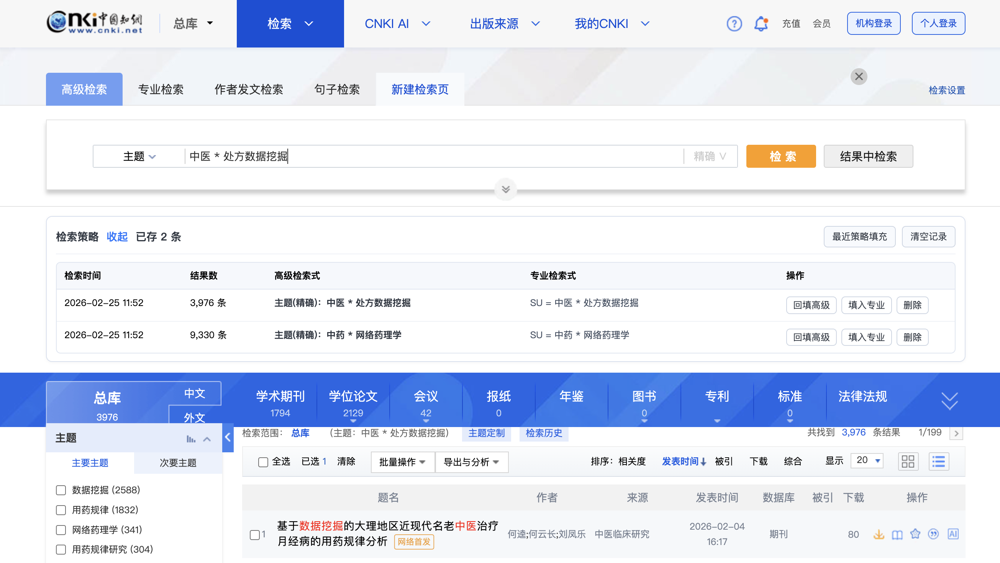

# CNKI 检索增强

⚠️ 适用于知网新版高级检索页：  [https://kns.cnki.net/kns8s/AdvSearch](https://kns.cnki.net/kns8s/AdvSearch)

## 项目简介

CNKI 原生高级检索在跨检索类型切换、多轮检索对比、检索式复用方面效率较低。  
本脚本把“高级检索”增强为一个轻量工作台，核心目标是：

1. 保留输入上下文，减少重复录入；
2. 支持并行检索，便于结果对比；
3. 沉淀可复用检索策略，一键回填。

## 主要功能

1. 新建检索页
- 在高级检索选项卡区域新增 `新建检索页` 入口。
- 点击后在新标签页打开一个“空白”高级检索页，不会覆盖当前页结果。

2. 高级检索草稿留存
- 在 `高级检索` 页面输入字段、逻辑、匹配方式、日期范围等后，切到 `专业检索 / 作者发文检索 / 句子检索` 再切回，可恢复草稿。
- 草稿使用 `sessionStorage`，仅在当前浏览器标签页生效，不跨标签传播。

3. 检索策略面板
- 在检索区与结果区之间新增 `检索策略` 面板。
- 自动记录高级检索执行历史，按行展示：
  - 检索时间
  - 结果数
  - 高级检索式（可读摘要）
  - 专业检索式（可直接复用）
  - 操作按钮
- 支持操作：
  - `回填高级`
  - `填入专业`
  - `删除`
  - `最近策略填充`
  - `清空记录`
  - `展开/收起`

4. 结果数记录
- 每次在高级检索点击 `检索` 后，脚本记录本次策略并尝试写入检索结果条目数（优先读取页面结果计数）。

5. 历史容量与状态持久化
- 策略历史默认最多保留 `80` 条（`HISTORY_LIMIT`）。
- 面板展开/收起状态持久化到 `localStorage`。

## 可配置项

在脚本顶部可直接调整以下开关/参数：

1. `AUTO_COLLAPSE_ON_SEARCH`
- 默认 `false`。
- 设为 `true` 时，每次点击高级检索 `检索` 后自动收起检索策略面板。

2. `HISTORY_LIMIT`
- 默认 `80`。
- 控制本地最大策略记录数。

## 安装与使用

1. 安装用户脚本管理器（Tampermonkey）
- Edge: [Tampermonkey for Edge](https://microsoftedge.microsoft.com/addons/detail/%E7%AF%A1%E6%94%B9%E7%8C%B4/iikmkjmpaadaobahmlepeloendndfphd?hl=zh-CN)
- Firefox: [Tampermonkey for Firefox](https://addons.mozilla.org/zh-CN/firefox/addon/tampermonkey/)
- Chrome: [Tampermonkey for Chrome](https://chromewebstore.google.com/detail/tampermonkey/dhdgffkkebhmkfjojejmpbldmpobfkfo?hl=zh-CN&utm_source=ext_sidebar)

2. 通过[知网检索增强 (greasyfork.org)](https://greasyfork.org/zh-CN/scripts/490258-知网检索增强) 安装 **（推荐）**，或在 Tampermonkey 中新建脚本并粘贴 `cnki_search_enhancer.usr.js` 内容。
3. 打开高级检索页开始使用：[https://kns.cnki.net/kns8s/AdvSearch](https://kns.cnki.net/kns8s/AdvSearch)
## 兼容性与说明

1. 适配对象
- 知网新版高级检索页面（`/kns8s/AdvSearch*`）。

2. 浏览器
- 以 Chromium 内核浏览器（Edge/Chrome）为主进行验证。
- Firefox 可用性取决于页面动态脚本行为，建议自行验证。

3. 数据与隐私
- 不向第三方发送检索内容。
- 检索策略/面板状态仅存储在本地浏览器（`localStorage`/`sessionStorage`）。

## 许可证

本仓库采用 `GPL-3.0`。

## Demo

